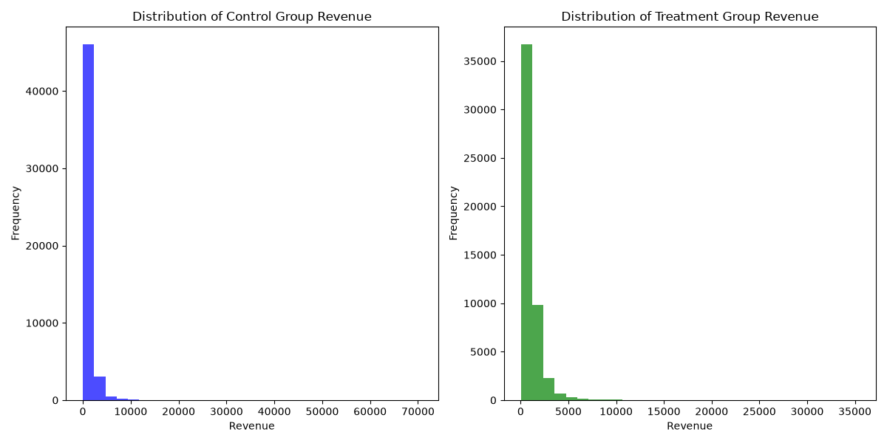
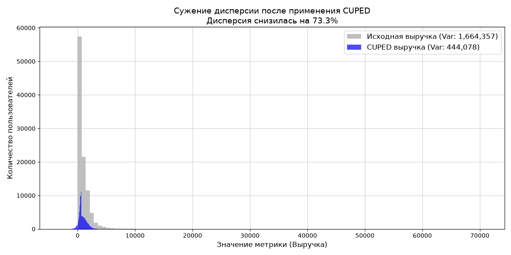

# Сравнение мощности A/B-тестов: снижение дисперсии с помощью CUPED

**Author:** Valentin Zavgorodnii

Проект демонстрирует ручную реализацию и математическое обоснование метода **CUPED** (Controlled-experiment Using Pre-Experiment Data) для повышения чувствительности A/B-тестов на зашумленных финансовых данных. Вся архитектура эксперимента, генерация данных и статистические проверки написаны с нуля для глубокого контроля над логикой исследования.

---

## Описание проблемы

В финтехе и e-commerce продуктовые метрики (например, выручка) часто имеют **логнормальное распределение с тяжёлыми хвостами**. Наличие пользователей-«китов» создаёт огромную дисперсию, из-за которой классический t-тест Стьюдента теряет статистическую мощность и не может зафиксировать реальный положительный эффект от продуктовых изменений (выдаёт **False Negatives**).

**Бизнес-последствия:** Компания внедряет успешную фичу, но аналитик не может доказать её эффективность. Решение откатывают, деньги и время потрачены впустую.

---

## Решение: CUPED

**CUPED** (Controlled-experiment Using Pre-Experiment Data) — метод, разработанный в Microsoft, который использует исторические данные пользователей (ковариаты) для снижения дисперсии целевой метрики.

### Математическая постановка

$$Y_{CUPED} = Y - \theta \cdot (X - \bar{X})$$

где:
- $Y$ — целевая метрика в эксперименте
- $X$ — ковариата (историческое значение метрики)
- $\bar{X}$ — среднее ковариаты по всей выборке
- $\theta$ — коэффициент, минимизирующий дисперсию:

$$\theta = \frac{\text{Cov}(Y, X)}{\text{Var}(X)}$$

### Ключевое свойство

$$Var(Y_{CUPED}) = Var(Y) \cdot (1 - \rho^2)$$

где $\rho$ — корреляция между $Y$ и $X$.

**Интерпретация:** Чем сильнее историческое поведение коррелирует с текущим, тем больше снижается дисперсия.

---

## Архитектура проекта

cuped-ab-testing/
│
├── src/
│ └── data_generator.py # Генерация логнормальных данных
│
├── notebooks/
│ └── 01_cuped_analysis.ipynb # Основной анализ: EDA, CUPED, Monte Carlo
│
├── graphs/
│ ├── revenue_distributions.png # Распределение выручки по группам
│ └── cuped_variance_reduction.png # Сужение дисперсии после CUPED
│
├── README.md
└── requirements.txt

---

## Результаты

Эксперимент проведён на синтетических данных, имитирующих транзакции интернет-магазина. Заложенный эффект: **+15 рублей** на пользователя в тестовой группе.

### 1. Классический t-тест (сырые данные)

| Метрика | Значение |
|---------|----------|
| **t-statistic** | 0.89 |
| **p-value** | 0.3735 |
| **Решение** | Не отвергаем H₀ |

**Вывод:** Тест «слеп» из-за шума. Бизнес теряет успешную фичу.

---

### 2. CUPED t-тест (трансформированные данные)

| Метрика | Значение |
|---------|----------|
| **t-statistic** | 4.39 |
| **p-value** | **0.000012** |
| **Решение** | Отвергаем H₀ |

**Ключевой результат:** Дисперсия метрики снижена на **73.3%**.

---

### 3. Monte Carlo симуляция (1000 экспериментов)

Для доказательства надёжности метода проведена симуляция 1000 независимых A/B-тестов ($\alpha = 0.05$).

| Метод | Мощность (Power) |
|-------|------------------|
| **Классический t-тест** | **0.0%** (0 успехов из 1000) |
| **CUPED** | **100.0%** (1000 успехов из 1000) |

**Вывод:** CUPED делает тест чувствительным даже в условиях сильного шума, где классический подход полностью бесполезен.

---

## Визуализации

### Распределение выручки в контрольной и тестовой группах

### Снижение дисперсии после применения CUPED

---

## Бизнес-выводы

1. **CUPED статистически значим:** p-value = 0.000012 — эффект доказан.
2. **Снижение дисперсии на 73.3%:** Это позволяет сократить размер выборки почти в 2 раза.
3. **Рост мощности с 0% до 100%:** Бизнес перестаёт пропускать реальные улучшения.
4. **Экономия времени:** Внедрение CUPED может сократить длительность экспериментов на 2–3 недели без потери качества.

**Рекомендация:** Внедрить CUPED как стандартный метод анализа A/B-тестов в компании.

---

## Технологический стек

| Компонент | Технологии |
|-----------|------------|
| **Генерация данных** | NumPy |
| **Статистика** | SciPy (t-тест Уэлча, ковариация) |
| **Визуализация** | Matplotlib |
| **Симуляция** | Монте-Карло (1000 итераций) |

---

