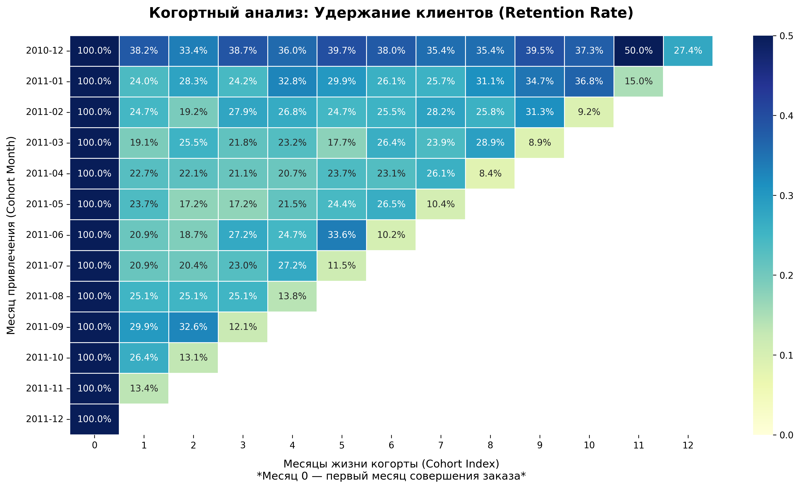
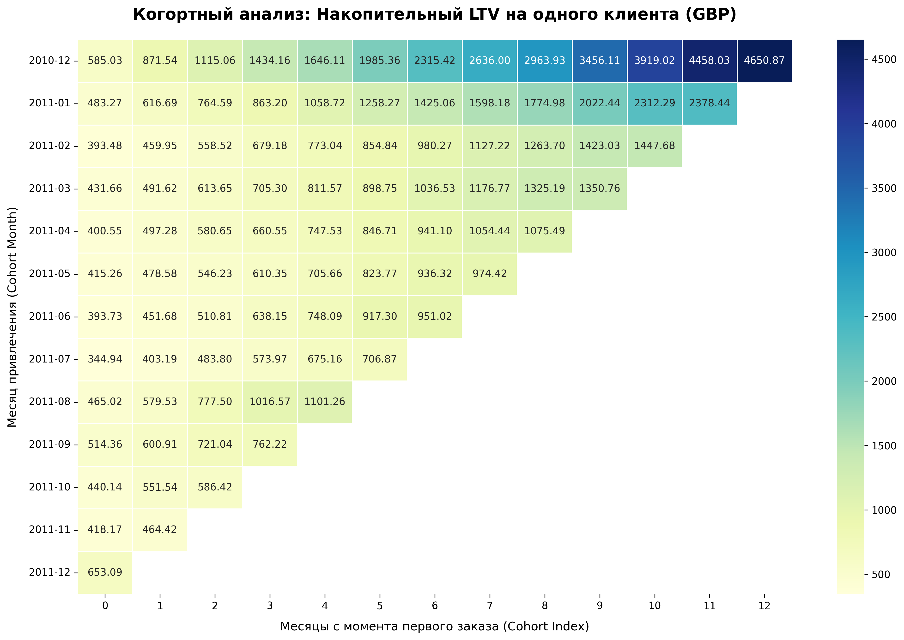

# Когортный анализ интернет-магазина (Retention & LTV)

Расчёт удержания клиентов и кумулятивного LTV на данных транзакций e-commerce.

## Цель
Определить наиболее ценные когорты, выявить сезонные аномалии и сформулировать рекомендации для маркетинга.

## Технологии
Python, Pandas, Matplotlib, Seaborn, Jupyter Notebook.

## Данные
Источник: [Online Retail (UCI / Kaggle)](https://www.kaggle.com/datasets/vijayuv/onlineretail)  
Период: декабрь 2010 – декабрь 2011. Лицензия ODbL.

## Запуск

pip install pandas matplotlib seaborn jupyter
jupyter notebook cohort-retention-ltv.ipynb

Файл `OnlineRetail.csv` в той же директории.

## Предобработка

* Удалены строки без `CustomerID`.
* Сохранены отрицательные `Quantity` (возвраты) → чистая выручка `NetRevenue = Quantity * UnitPrice`.
* Агрегация по `(InvoiceNo, StockCode, CustomerID, InvoiceDate)` для устранения дубликатов.

## Результаты

**Удержание (Retention)**

* Когорта дек. 2010: удержание 33–39% весь год, пик 50% на 11-й месяц (сезонный возврат).
* Когорты 2011: падение до 19–25% уже на 1-й месяц.
* → Усилить удержание на 2–3 месяц после привлечения.

**LTV (кумулятивный на клиента)**

* Когорта дек. 2010: ~4650 GBP за 12 месяцев (лидер).
* Когорта авг. 2011: на 3-й месяц 1016 GBP против средних 600–700 GBP (высокий чек).
* → Проанализировать маркетинг дек. 2010 и авг. 2011, масштабировать на низкие сезоны.

## Ограничения

* Обрыв данных на дек. 2011 → LTV последней когорты недооценён.
* Возвраты учтены, но невозможно разделить отказ при покупке и возврат через месяц.

## Графики

