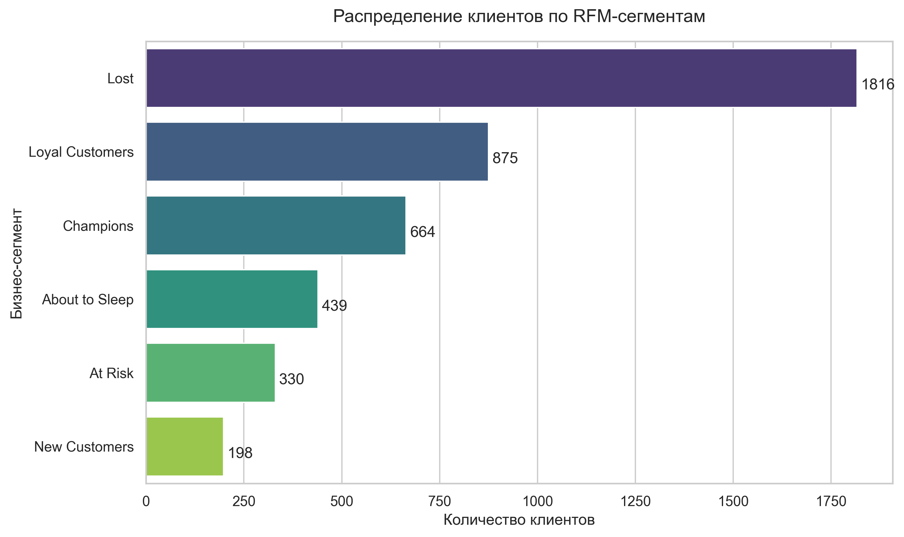
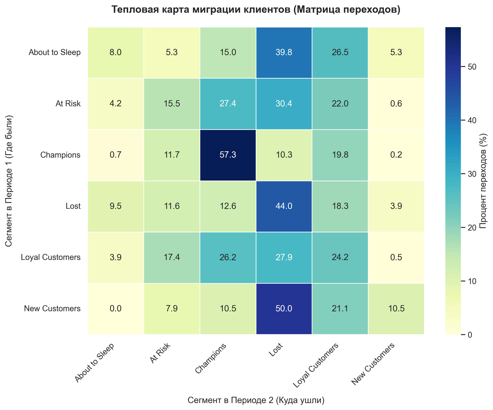

# RFM-анализ клиентской базы с матрицей переходов

Анализ сегментации клиентов интернет-магазина на основе методологии RFM (Recency, Frequency, Monetary) с построением матрицы миграции между сегментами во времени.

---

## Описание проекта

Проект реализует динамический RFM-анализ, позволяющий не только сегментировать клиентскую базу, но и отслеживать изменения в поведении клиентов между двумя временными периодами. Такой подход даёт понимание не просто "кто есть кто", а "куда движутся клиенты" — критически важная информация для маркетингового планирования.

**Стек:** Python, Pandas, NumPy, Matplotlib, Seaborn.

---

## Методология

Расчёт RFM-оценок (от 1 до 5):

- **Recency** – давность последней покупки (квантили)
- **Frequency** – количество заказов (ранжирование с обработкой дубликатов)
- **Monetary** – суммарная выручка (ранжирование)

Сегментация выполнена на основе комбинации всех трёх показателей:

| Сегмент | R-оценка | F-оценка | M-оценка | Описание |
|---------|----------|----------|----------|----------|
| Champions | 4-5 | 4-5 | 4-5 | Ядро лояльности: покупают часто и дорого |
| Loyal Customers | 3-5 | 3-5 | 3-5 | Стабильные клиенты со средним/высоким чеком |
| New Customers | 4-5 | 1 | 1-2 | Недавно привлечены, одна покупка |
| About to Sleep | 3-5 | 1-2 | 1-2 | Снижение активности, низкий чек |
| At Risk | 1-2 | 3-5 | 3-5 | Бывшие VIP, давно не возвращались |
| Lost | остальные | остальные | остальные | Низкая активность, старые покупки |

Матрица переходов построена путём разделения данных на два равных периода (по медианной дате) и сопоставления сегментов каждого клиента в первом и втором периодах.

---

## Результаты

### Статическое распределение



**Ключевые наблюдения:**
- **Lost** – крупнейший сегмент (1816 клиентов). Большая часть базы неактивна.
- **Champions + Loyal** – устойчивое ядро (1539 клиентов), обеспечивающее основной доход.
- **New Customers** – наименьший сегмент (198), что указывает на слабый приток новых клиентов в анализируемый период.

### Матрица переходов



**Ключевые тренды:**
- **Champions** демонстрируют высокую стабильность: 57.3% сохраняют статус. Однако 10.3% уходят в Lost – сигнал о необходимости усиления программы лояльности для топ-сегмента.
- **Новички (New Customers)** – критическая точка: 50% переходят в Lost. Удержание на этапе второй покупки отсутствует.
- **About to Sleep** – 39.8% окончательно теряются. Требуется реактивация до того, как клиент перейдёт в Lost.
- **At Risk** – 30.4% уходят в Lost при всего 15.5% возвращения в Champions. Бывшие VIP-клиенты требуют срочного внимания.

---

## Бизнес-рекомендации

| Сегмент | Риск по матрице | Рекомендация |
|---------|-----------------|--------------|
| Champions | 10.3% уходят в Lost | Программа лояльности, эксклюзивные предложения, персональный менеджер. Исключить из массовых скидочных рассылок для сохранения маржи. |
| New Customers | 50% → Lost | Welcome-цепочка: промокод на второй заказ в течение 14 дней. Цель – превратить разовую покупку в повторную. |
| About to Sleep | 39.8% → Lost | Триггерные письма с персонализированными рекомендациями или опросом о качестве. Вернуть интерес до полного оттока. |
| At Risk | 30.4% → Lost | Агрессивный оффер (скидка 20-30% + подарок). Стоимость удержания бывшего VIP ниже, чем привлечение нового клиента аналогичного уровня. |
| Lost | Неактивны | Одна автоматическая email-кампания. При отсутствии реакции – исключить из платных каналов коммуникации для экономии бюджета. |

---

## Ограничения анализа

- Данные разделены по медианной дате на два периода. Сезонность (рождественские пики) не вычиталась, что может влиять на интерпретацию переходов.
- Monetary используется в сегментации, но в матрице переходов анализируется только смена сегментов, а не динамика денежных потоков внутри сегментов.
- Клиенты, не совершавшие покупок в одном из периодов, исключены из матрицы переходов (inner join). Это может занижать реальный отток.

---

## Запуск проекта

```bash
pip install pandas numpy matplotlib seaborn jupyter
jupyter notebook rfm_analysis.ipynb